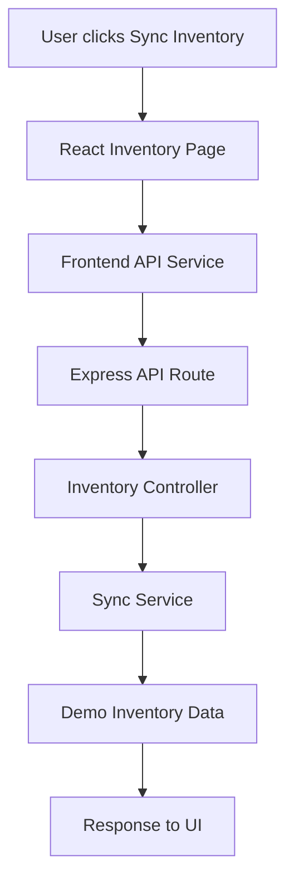

# GitHub Copilot Prompts and Step-by-Step Guide to Understand BrickBuddyApp Codebase

This document explains how to use **GitHub Copilot effectively to understand the BrickBuddyApp codebase**, create a **project cheat sheet**, and store the cheat sheet in the correct place.

---

## 1. First Open the Project in VS Code

After downloading and extracting the ZIP file, open the project folder in VS Code.

Your structure will look similar to this:

```text
BrickBuddyApp
│
├── .github
│   └── copilot-instructions.md
│
├── api
│   ├── controllers
│   ├── routes
│   ├── services
│   └── data
│
├── docs
│   ├── project_cheat_sheet.md
│   └── sync_journey_map.md
│
├── ui
│   ├── src
│   ├── pages
│   ├── components
│   └── services
│
├── scripts
├── package.json
└── package-lock.json
```

**Important point:** GitHub Copilot works better when it has good project context.

Copilot can understand the project using:

- Open files
- Selected code
- Workspace context
- File references
- Custom instructions
- Workspace indexing

---

## 2. Important Setup Before Asking Copilot

### Step 1: Install Required Extensions

In VS Code, install:

```text
GitHub Copilot
GitHub Copilot Chat
```

### Step 2: Sign in to GitHub

In VS Code:

```text
Accounts icon → Sign in with GitHub
```

### Step 3: Open Copilot Chat

Use any one option:

```text
Ctrl + Alt + I
```

or

```text
Click GitHub Copilot icon → Open Chat
```

### Step 4: Let Copilot Understand the Workspace

Keep the full project folder open.

GitHub Copilot can use workspace context to search and understand code across the project.

**Important point:** Do not open only one file. Open the full project folder in VS Code.

---

## 3. First Prompt to Understand the Full Project

Open **Copilot Chat** and paste this prompt:

```text
Analyze this entire BrickBuddyApp project.

Give me a beginner-friendly explanation of the codebase.

I want to understand:

1. What is the purpose of this application?
2. What are the main folders and their responsibilities?
3. Which part is frontend?
4. Which part is backend?
5. How does the React UI communicate with the Express API?
6. What are the main pages/components?
7. What are the main API routes?
8. What services are used in the backend?
9. What is the inventory sync workflow?
10. What is the pricing troubleshooting flow?
11. What files should a new developer read first?

Give the explanation in a clear heading/subheading format.
Do not change any code.
```

### What this prompt does

This prompt asks Copilot to give a **high-level architecture overview**.

It is useful when a developer joins a new project and wants to understand the project quickly.

---

## 4. Prompt to Create a Project Cheat Sheet

After Copilot gives the explanation, use this prompt:

```text
Create a project cheat sheet for this BrickBuddyApp codebase.

The cheat sheet should include:

1. Project purpose
2. Folder structure explanation
3. Frontend architecture
4. Backend architecture
5. Important React pages
6. Important backend routes
7. Important services
8. Inventory sync workflow
9. Catalog pricing workflow
10. API testing page purpose
11. Common developer tasks
12. Useful GitHub Copilot prompts for this project
13. Important files to read first
14. Common debugging areas
15. Summary for new developers

Create this as a Markdown document.
Use clear headings, subheadings, bullet points, and highlight important points.
```

---

## 5. Where to Keep the Cheat Sheet

Create this file:

```text
docs/project_cheat_sheet.md
```

This file is for **human developers**.

It should explain the project in a readable format.

Recommended location:

```text
BrickBuddyApp
│
├── docs
│   └── project_cheat_sheet.md
```

### Why keep it inside `docs`?

Because `docs` is the standard place for project documentation.

You can keep:

```text
project_cheat_sheet.md
sync_journey_map.md
api_flow.md
troubleshooting_notes.md
dependency_map.md
```

---

## 6. Prompt to Ask Copilot to Create the Cheat Sheet File

Go to Copilot **Edit mode** or **Agent mode** and use this prompt:

```text
Create a new Markdown file at docs/project_cheat_sheet.md.

Use the current BrickBuddyApp codebase as context.

The cheat sheet should explain:

- Project overview
- Folder structure
- React frontend flow
- Express backend flow
- API route structure
- Inventory sync workflow
- Pricing issue troubleshooting flow
- Important files
- Common developer tasks
- Useful Copilot prompts

Use simple language because this document is for students and new developers.

Do not modify existing application code.
Only create the Markdown documentation file.
```

---

## 7. How to Keep Cheat Sheet for Copilot Usage

There are two types of documents you should maintain.

### A. Human Cheat Sheet

Keep this here:

```text
docs/project_cheat_sheet.md
```

Purpose:

```text
For developers, students, trainers, and team members.
```

### B. Copilot Instructions File

Keep this here:

```text
.github/copilot-instructions.md
```

Purpose:

```text
For GitHub Copilot to understand the project rules, architecture, patterns, and coding standards.
```

GitHub Copilot supports repository custom instructions through this file path:

```text
.github/copilot-instructions.md
```

This file should be placed in the root of the repository.

---

## 8. Prompt to Create Copilot Instructions

Use this prompt in Copilot Chat or Edit mode:

```text
Create or update .github/copilot-instructions.md for this BrickBuddyApp project.

Use the project cheat sheet and codebase as context.

The instructions should tell GitHub Copilot:

1. This is a React + Express demo application.
2. The frontend is inside the ui folder.
3. The backend API is inside the api folder.
4. React pages call backend APIs through service files.
5. Backend routes call controllers.
6. Controllers call services.
7. Services contain business logic.
8. Inventory sync flow should follow the existing sync service pattern.
9. Pricing logic should follow the catalog pricing service pattern.
10. Do not create unnecessary new folders if an existing pattern is already available.
11. Use simple readable code.
12. Keep this project suitable for teaching GitHub Copilot codebase understanding.

Do not modify application functionality.
Only update the copilot-instructions.md file.
```

---

## 9. Sample `.github/copilot-instructions.md`

You can keep this inside:

```text
.github/copilot-instructions.md
```

```md
# GitHub Copilot Instructions for BrickBuddyApp

## Project Overview

BrickBuddyApp is a teaching/demo application used to explain how GitHub Copilot can help developers understand an unfamiliar codebase.

The application demonstrates:

- React frontend structure
- Express backend API structure
- Inventory synchronization workflow
- Catalog pricing troubleshooting flow
- API testing page
- Project documentation using Markdown

## Project Architecture

The project is divided into two main parts:

- `ui/` contains the React frontend.
- `api/` contains the Express backend.

## Frontend Rules

The React frontend is located inside the `ui` folder.

Important frontend areas:

- `ui/src/pages` contains page-level components.
- `ui/src/components` contains reusable UI components.
- `ui/src/services` contains API calling logic.

When adding frontend features:

- Reuse existing components where possible.
- Keep page logic clear and readable.
- Keep API calls inside service files.
- Do not directly write backend URLs in many components.

## Backend Rules

The Express backend is located inside the `api` folder.

Important backend areas:

- `api/routes` contains route definitions.
- `api/controllers` receives API requests.
- `api/services` contains business logic.
- `api/data` contains demo data.

Backend flow should usually follow this pattern:

Client → Route → Controller → Service → Data

## Inventory Sync Flow

Inventory sync starts from the React UI.

Expected flow:

User clicks Sync Inventory  
→ React page calls frontend service  
→ frontend service calls backend API  
→ backend route calls controller  
→ controller calls sync service  
→ sync service processes inventory data  
→ response returns to UI

## Pricing Troubleshooting Flow

Catalog pricing demonstrates a real debugging scenario.

When analyzing pricing issues, check:

- Catalog page
- API service call
- Backend route
- Controller
- Pricing service
- Region-based price logic
- Condition-based price logic

## Copilot Behavior

When helping with this project, GitHub Copilot should:

- Explain code in simple language.
- Prefer existing folder patterns.
- Avoid inventing services or repositories that do not exist.
- Check existing files before suggesting new files.
- Suggest documentation updates when architecture changes.
- Keep code suitable for classroom training.

## Documentation Files

Important documentation files:

- `docs/project_cheat_sheet.md`
- `docs/sync_journey_map.md`
- `.github/copilot-instructions.md`

## Teaching Purpose

This project is mainly used to teach:

- Codebase navigation
- Project architecture understanding
- Dependency tracing
- Debugging with Copilot
- Creating living documentation
```

---

## 10. Prompt to Understand Folder Structure

Use this prompt:

```text
Explain the folder structure of this BrickBuddyApp project.

For each folder, explain:

1. What is stored inside it?
2. Why it is needed?
3. Which files are most important?
4. How this folder connects with other folders?

Explain like I am teaching students.
```

---

## 11. Prompt to Understand Frontend Flow

Use this prompt:

```text
Explain the React frontend flow in this project.

Start from the main React entry file and explain:

1. How the app starts
2. How pages are loaded
3. How components are reused
4. How API calls are made
5. Which service files communicate with backend
6. How inventory sync is triggered from UI
7. How catalog pricing is displayed

Give file names wherever possible.
```

---

## 12. Prompt to Understand Backend Flow

Use this prompt:

```text
Explain the Express backend flow in this project.

Start from the backend entry file and explain:

1. How the Express server starts
2. How routes are registered
3. How controllers handle requests
4. How services contain business logic
5. How demo data is used
6. Which API endpoint is used for inventory sync
7. Which API endpoint is used for catalog pricing

Give file names and flow diagram.
```

---

## 13. Prompt to Trace Inventory Sync Workflow

Use this prompt:

```text
Trace the complete inventory sync workflow in this project.

Start from the Sync Inventory button in the React UI.

Follow the flow step by step:

1. UI button click
2. React function
3. Frontend service/API call
4. Backend route
5. Controller method
6. Backend service
7. Final response
8. UI update after response

Create a simple ASCII flow diagram also.
```

Expected output from Copilot should be like:

```text
User clicks Sync Inventory
        |
        v
React Inventory Page
        |
        v
Frontend API Service
        |
        v
Express Route
        |
        v
Inventory Controller
        |
        v
Sync Service
        |
        v
Response sent back to UI
```

---

## 14. Prompt to Create Sync Journey Map

Use this prompt:

```text
Create or update docs/sync_journey_map.md.

Document the full inventory sync journey in this project.

Include:

1. User action
2. Frontend function
3. API call
4. Backend route
5. Controller
6. Service
7. Response
8. Error handling
9. ASCII diagram
10. Important files involved

Use simple language for students.
Do not change application code.
```

---

## 15. Prompt to Trace Pricing Bug

Use this prompt:

```text
Help me troubleshoot the catalog pricing flow in this BrickBuddyApp project.

Scenario:

A user says the same brick item shows different prices.

Trace the flow from:

1. Catalog page
2. Price display logic
3. Frontend API call
4. Backend route
5. Controller
6. Pricing service
7. Region-based pricing
8. Final response

Find possible places where the pricing issue can happen.

Do not modify the code.
Only explain the flow and possible bug locations.
```

---

## 16. Prompt to Find Reusable Components

Use this prompt:

```text
Find reusable components in the React frontend.

Check the ui/src folder and tell me:

1. Which components are reused?
2. Where are they used?
3. What is the purpose of each component?
4. Can any repeated UI code be converted into a reusable component?

Give examples with file names.
```

---

## 17. Prompt to Understand API Endpoints

Use this prompt:

```text
List all backend API endpoints in this Express application.

For each endpoint, explain:

1. HTTP method
2. Route URL
3. Controller method
4. Service method
5. Purpose
6. Sample request
7. Sample response

Present the result in a Markdown table.
```

---

## 18. Prompt to Generate Dependency Map

Use this prompt:

```text
Create a dependency map for this BrickBuddyApp project.

Show how files depend on each other for:

1. Inventory sync
2. Catalog pricing
3. API testing page

Use this format:

UI Page
→ Frontend Service
→ Backend Route
→ Controller
→ Service
→ Data

Also create a Mermaid diagram if possible.
```

---

## 19. Prompt to Create Mermaid Diagram

Use this prompt:

````text
Create a Mermaid flowchart for the inventory sync workflow.

The flow should include:

User
React UI
Frontend service
Express route
Controller
Sync service
Demo data
API response
UI update

Save the diagram inside docs/sync_journey_map.md.
````

Example Mermaid format:

````md

````

---

## 20. GitHub Copilot Features to Use Practically

### Feature 1: Copilot Chat

Use this to ask questions about the project.

Example:

```text
Explain this file in simple language.
```

```text
What is the role of this controller?
```

```text
Where is this API endpoint called from the frontend?
```

Copilot Chat can combine your prompt with open files, selected code, and workspace information to generate contextual answers.

---

### Feature 2: `#codebase`

Use `#codebase` when you want Copilot to search the full project.

Example:

```text
#codebase Where is the inventory sync API implemented?
```

```text
#codebase Find all files related to catalog pricing.
```

```text
#codebase Explain how the frontend connects to the backend.
```

The `#codebase` tool helps Copilot perform semantic search across the codebase and is useful for large projects.

---

### Feature 3: Add Context Manually

You can manually attach files to Copilot Chat.

Practical example:

Open:

```text
UserInventory.jsx
inventoryService.js
inventoryRoutes.js
inventoryController.js
syncService.js
```

Then ask:

```text
Using these files as context, explain the full inventory sync workflow.
```

This is useful when you want Copilot to focus on specific files.

---

### Feature 4: Drag and Drop Files into Chat

You can drag files from Explorer into Copilot Chat.

Example:

Drag these files:

```text
Catalog.jsx
catalogService.js
pricingService.js
catalogRoutes.js
```

Then ask:

```text
Using these files, explain how catalog pricing works.
```

This is very useful when Copilot gives a generic answer and you want to force it to focus on specific files.

---

### Feature 5: Slash Commands

Useful slash commands include:

```text
/explain
/fix
/tests
/clear
```

Practical usage:

```text
/explain Explain this selected code line by line.
```

```text
/fix Find the bug in this selected function.
```

```text
/tests Generate test cases for this service.
```

```text
/clear
```

Use `/clear` when the current chat history is confusing Copilot.

---

### Feature 6: Inline Chat

Use inline chat when you are inside a file.

Shortcut:

```text
Ctrl + I
```

Select code and ask:

```text
Explain this function.
```

```text
Add comments to this function.
```

```text
Refactor this function without changing behavior.
```

Inline chat is useful for small code-level changes.

---

### Feature 7: Ghost Text Suggestions

Ghost text suggestions appear while typing.

Example:

Start typing:

```js
function calculateTotalPrice
```

Copilot may suggest the full function body.

Use:

```text
Tab
```

to accept the suggestion.

This is useful for writing repetitive code, boilerplate, validation logic, and API calls.

---

### Feature 8: Copilot Edits

Use Copilot Edits when you want Copilot to modify or create files.

Example prompt:

```text
Create docs/api_endpoints.md.

Analyze the Express routes and document all API endpoints with purpose, request, and response examples.

Do not modify application code.
```

This is better than normal chat when you want Copilot to actually create files.

---

### Feature 9: Agent Mode

Agent mode is useful for multi-file tasks.

Example:

```text
Add a new documentation page called docs/pricing_troubleshooting.md.

Analyze the catalog pricing flow and document the possible reasons for price mismatch.

Include frontend files, backend files, API endpoint, and service logic.

Do not change source code.
```

Copilot agent mode can perform multi-step coding tasks across files.

---

### Feature 10: Custom Instructions

Custom instructions help Copilot behave consistently for this project.

Keep the file here:

```text
.github/copilot-instructions.md
```

Use it to tell Copilot:

```text
This project uses React frontend and Express backend.
Follow existing folder structure.
Do not create unnecessary new files.
Use simple teaching-friendly explanations.
Prefer service layer for business logic.
```

---

## 21. Best Practical Workflow for Students

Use this order when exploring the project:

### Step 1: Ask for Project Overview

```text
#codebase Give me a high-level overview of this BrickBuddyApp project.
```

### Step 2: Ask for Folder Explanation

```text
Explain the folder structure and purpose of each folder.
```

### Step 3: Ask for Frontend Flow

```text
Trace how the React frontend works from App.jsx to pages and components.
```

### Step 4: Ask for Backend Flow

```text
Trace how the Express backend handles API requests from route to controller to service.
```

### Step 5: Ask for Feature Flow

```text
Trace the inventory sync workflow from button click to API response.
```

### Step 6: Create Cheat Sheet

```text
Create docs/project_cheat_sheet.md with architecture, important files, workflows, and useful prompts.
```

### Step 7: Create Copilot Instructions

```text
Create .github/copilot-instructions.md based on the project cheat sheet.
```

### Step 8: Use the Instructions for Future Queries

Ask:

```text
Using the repository instructions, explain how to add a new feature following the existing pattern.
```

---

## 22. Very Useful Final Prompt for This Project

You can use this complete prompt directly in GitHub Copilot:

```text
You are helping me understand the BrickBuddyApp project.

This is a React + Express demo application used to teach GitHub Copilot codebase understanding.

Please analyze the complete codebase and create a beginner-friendly project cheat sheet.

The cheat sheet should include:

1. Application purpose
2. Technology stack
3. Folder structure
4. Frontend architecture
5. Backend architecture
6. API communication flow
7. Inventory sync workflow
8. Catalog pricing workflow
9. API testing page explanation
10. Important files and their purpose
11. Reusable components
12. Common debugging areas
13. How to add a new feature
14. Useful GitHub Copilot prompts
15. Summary for new developers

Create the file at:

docs/project_cheat_sheet.md

Use Markdown format with headings, subheadings, bullet points, and highlighted important notes.

Do not modify any source code.
Only create or update documentation.
```

---

## 23. Trainer Explanation

You can explain to students like this:

**GitHub Copilot is not only for writing code. It is also useful for understanding an existing codebase.**

In a real company, developers often join projects without proper documentation.

In that case, Copilot can help them:

- Understand folder structure
- Identify frontend and backend flow
- Trace API calls
- Find reusable components
- Understand business logic
- Create project documentation
- Debug issues faster
- Generate flow diagrams
- Create onboarding cheat sheets

But one important point:

**Copilot is a copilot, not the driver.**

That means the developer must verify Copilot’s answer by opening the actual files and checking whether the explanation is correct.

Copilot can sometimes assume wrong file names or invent patterns if we do not give enough context.

So the best practice is:

```text
Ask → Verify → Add Context → Ask Again → Document
```

That is the correct way to use GitHub Copilot effectively for understanding a codebase.

---

## 24. Key Takeaways

- Use Copilot Chat to understand files and architecture.
- Use `#codebase` to search across the full project.
- Use Copilot Edits or Agent Mode to create documentation files.
- Keep human documentation inside the `docs` folder.
- Keep Copilot-specific instructions inside `.github/copilot-instructions.md`.
- Always verify Copilot output with actual source code.
- Use the workflow: **Ask → Verify → Add Context → Ask Again → Document**.
