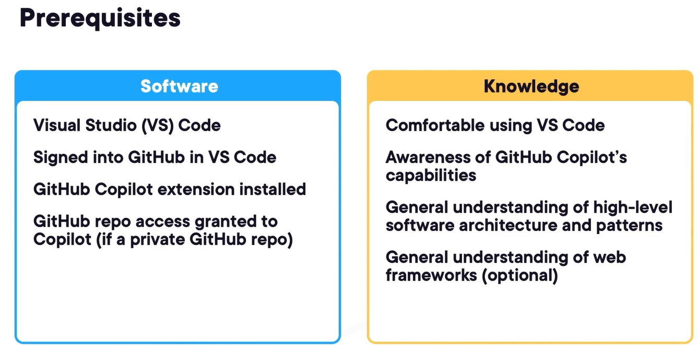
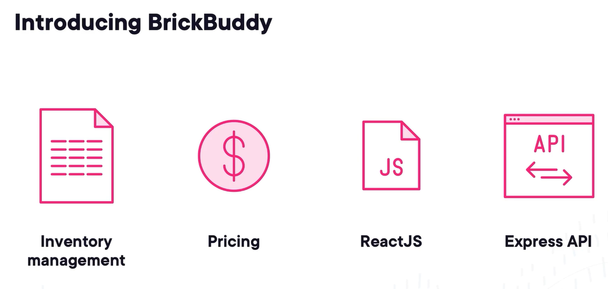
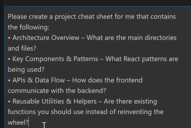

# Navigating and Analyzing Codebases with GitHub Copilot

> **Purpose of these notes:** Learn how to use **GitHub Copilot** to understand a new codebase, identify project architecture, create reusable documentation, trace code paths, map dependencies, and troubleshoot bugs using codebase context.

## Key Highlights

- **GitHub Copilot can help developers understand undocumented codebases faster.**
- **Always index the workspace** before asking architecture-level questions so Copilot has better codebase context.
- **Custom instructions act like persistent project memory** and help Copilot provide consistent answers.
- **Copilot is a co-pilot, not the driver.** You must provide context, verify answers, and steer it with clear prompts.
- **Use markdown cheat sheets, ASCII diagrams, UML diagrams, and PlantUML** to convert Copilot findings into living documentation.
- **When troubleshooting, start from the visible UI issue and trace the flow step by step** through API endpoints, controllers, services, database queries, and configuration settings.

## Table of Contents

1. [Understanding Project Patterns](#1-understanding-project-patterns)
2. [Dependency Mapping and Tracing Code Paths](#2-dependency-mapping-and-tracing-code-paths)
3. [Troubleshooting with the Codebase Context](#3-troubleshooting-with-the-codebase-context)

---

## 1. Understanding Project Patterns

### Course Introduction

> **Important:** Before modifying a new project, first understand the application architecture, shared components, patterns, and data flow.

Ever landed in a new project with zero documentation and felt overwhelmed? In this module, we'll explore how **GitHub Copilot** can help you quickly understand project patterns and architecture, turning that overwhelming first day into a productive exploration of your new codebase. Before we dive into exploring codebases with **GitHub Copilot**, let's make sure you have everything needed for success. First, on the software side, you'll need **Visual Studio Code**. I'm using version 1.97. While the techniques we'll cover will work with other versions, we'll be using 1.97 in our demos to ensure consistency.

You also need to be signed in to GitHub within **VS Code**. Speaking of which, make sure you have both the **GitHub Copilot extension** installed and properly configured. If you're working with a **private repository**, don't forget to grant Copilot access to it. Now for the knowledge prerequisites. You should be comfortable with navigating around **VS Code**, but don't worry if you're not an expert. Basic familiarity with the interface and common operations is sufficient. You should also have a general knowledge of **GitHub Copilot** and what it can do.

Just the basic knowledge will be fine. We'll build on this foundation throughout the course. While not mandatory, having a general understanding of software architecture patterns and web frameworks will help you get the most out of this course. We'll be using the web framework **ReactJS** and Express server, some web development frameworks, but don't worry if you're not strong in web frameworks or in web frameworks at all. The principles we'll be covering will apply broadly across any codebase.

Now before we get too far, I need to introduce you to the codebase we'll be navigating throughout this course called **BrickBuddy**, Globomantics' flagship application for managing their toy building piece business. At its core, **BrickBuddy** is a sophisticated inventory management system tracking thousands of unique pieces across multiple warehouses and retail locations for part sellers. The application handles dynamic pricing calculations, adjusting prices based on factors like rarity, condition, market demand, etc.



Now the front end is built with **ReactJS**, featuring a modern component-based architecture. You'll find this familiar if you've worked with web applications in the past, but **BrickBuddy** has its own unique patterns and structure we'll explore. Behind the scenes, an **Express API** handles all the heavy lifting, managing database interactions, business logic, and integration with various third-party services. And one final note, if you know nothing about web development at all, the skills you'll learn throughout this course will apply universally across many different languages and frameworks.

So you've just sat down at your desk on your first day and have never seen the codebase before. 


You're a great coder in the language you're working with, but don't know anything about the **BrickBuddy** application because unfortunately, the team building the app says they didn't have time to write the documentation. Before you can do any work to change the code, you must understand the app at a high level. You need to understand its architecture and any pattern used so you can begin contributing without repeating functionality of an existing component and using any shared components the team had already created.

You have **VS Code** installed, signed in GitHub, and have **GitHub Copilot** ready to go. You have a little experience with **GitHub Copilot**, but you don't know how to fully utilize it yet and are eager to get started.

### Demo 1: Discovering Project Architecture

> **Important:** A Copilot answer is only as strong as the context it receives. Use workspace indexing and iterative prompts to improve accuracy.

Let's dive into using **GitHub Copilot** to help us understand the **BrickBuddy** codebase. So first, let me click on the **GitHub Copilot** icon here, and then I'll click on Open Chat. Notice by default that we're currently connected to OpenAI's GPT 4o model. If I click on this drop-down, you can see other models, including the Cloud 3.5 Sonnet, which is currently in preview. As of this recording, Claude Sonnet is the leader in coding, so I'll use that. I've used Sonnet for a very long time and can say it is an excellent model for understanding code.

I'll use that one throughout this course. You can see I have the **BrickBuddy** workspace open there onto the left and ready to get started. Now if you're an experienced developer, you typically know what the language looks like and how to write the code, but you don't really understand the architecture, the nuances, and how a new codebase is developed. So let's figure that out. We'll start by creating a structured cheat sheet. I'll provide Copilot with a prompt. This just gives me a basic architecture overview, some key components and patterns, API data flows, just a general overview, just give me the gist of what this project is all about.

Let's see what happens. Now when that runs, you can see that it starts off with collecting workspace information, and it only used 12 references. Copilot has references that refer to files. Now, I know that this codebase is a lot bigger than 12 files, and unfortunately it only used 12 of those, so the architecture overview and all this information, it's going to be pretty good, but it's going to make a lot of assumptions because it doesn't know the entire **context** of our workspace. Now what you can do is first you need to create an index.

Now the index indexes all the files in your codebase. You can do this two different ways. You can build the **remote workspace index**. The **remote workspace index** goes up to GitHub, downloads all the files in the GitHub repo that you have, and then creates an index that saves it in GitHub. It's great for teams, but it takes forever because the index is stored up in GitHub. However, what I like to do is to Ctrl+Shift+P, type in index, and then you can build a **local workspace index**. When you do that, you can see on the lower left there updating the **local workspace index**, that's going through all of the files in the workspace that we have here, indexing all those, reading all of them, tokenizing them, creating vectors from them, creating them in a way that Copilot can easily query them for more **context**.

So this is going to take a couple of minutes, so we'll wait on that and come back when it is done. All right, great. It looks like it's done. That didn't take too long. Now let's try that exact prompt again and see what difference we have. So notice that we don't have any code examples or anything like that. You can tell that it didn't understand the entire thing. I'll create a new chat to make sure that this history doesn't affect our results. Paste in that same prompt again, hit Enter, and then now see it's used 86 references.

It'll use different references depending on what the query is. You'll see it all kinds of different ways. It's just trying to intelligently pick which files to load into its **context**. Now this is much better. We can see that it now has a directory structure, core components. It knows it's a React application, gives us error boundaries, code examples, so it knows a lot more about the codebase. Make sure that your codebase is indexed so it understands everything. Let's say that it's not that great.

It will normally be okay for one shot, but you usually need to iterate on it based on what you see. So I'm going to say, what components do you see used over and over? I want to have on this cheat sheet a list of the shareable components that the team that built this uses. Now it's going to give me a list of various components. Most of them are in the UI, but there's also things in the API, lots of different information in this **ReactJS** and Express server implementation. So that's another thing.

Always iterate on it, make sure that it's getting the information that you want. Now I'm lazy. I want to create that cheat sheet right now. The cheat sheet is available only in this **context** window. However, I want to create the cheat sheet in a markdown file. So how I can do that is I can come over here to Edits, which then creates files for me. Now I already had these Copilot instructions here as a **context**. I'm going to take that out because we're going to be looking at that in the next demo.



Now I'm going to say give me the same prompt that I used before. And then I will also put the same query in here about do you see any components used over and over? I'll use both of those in the same one and see what it tries to do. Now notice that we have GPT 4o. That's because it's the first conversation in edits, so I'll choose Claude 3.5 Sonnet. Hit Enter and see what happens. All right, great. It created a single markdown file. Since I didn't necessarily say that I wanted a single markdown file, it created one for me anyway.

It didn't have the same kind of detail, but you can iterate on this. Say give me more information, expand on the key components. You can do anything you want. You just talk to it in human language. However, right now I'm happy with this, so I'll just hit Accept, and I'll save this, and that will lead us right into the next demo where we're going to cover integrating this in **custom instructions**.

### Demo 2: Creating Custom Instructions

> **Important:** Store reusable project knowledge in `.github/copilot-instructions.md` so Copilot can use it repeatedly across conversations.

Now that we have our project cheat sheet, let's leverage it to make Copilot even more effective. One powerful feature of **GitHub Copilot** is its ability to use **custom instructions**. Custom instructions act as a persistent **context** for all your queries. It's kind of like memory for Copilot that it accesses for every query. So let's set that up. Instructions is a markdown file stored in the .github folder in the root of your workspace called **copilot-instructions.md**. Now we could manually create this instruction file, but let's have Copilot help us out with the task.

So I'll make sure first I'm in the Edits feature. Yep, still in there. I'll be using the same conversation because as it references the **conversation history**, it knows all about the project cheat sheet that we'll be working with in here. Let's paste in a prompt. I'm going to say exactly what I want, create the folder in the root of the project called .github with the specific markdown file containing all the contents from our project cheat sheet. So hopefully, this should do everything for us.

Let's find out. Looks like it worked. We have the .github folder, and we have the copilot-instructions file. Now we come over here, and exactly the same thing. I love the Edits feature of Copilot because it really helps save all the minutia that you have to go through with software development. So I'll just accept this, and I will save it. Now we have Copilot instructions set up. Now, let's **verify** that Copilot is now using these instructions. I will start a new conversation so we don't have all this in **context**.

It pulls the working set from the open files that you have. So if I close this and I close this, now you can see that the working set is not there. Start a new conversation. And let's say, what do you use for authentication state management? Just anything just to test if the instructions are working. And there we go. It automatically puts in Copilot instructions. And then now instead of going through the entire codebase, the entire index that it has, you can give it shortcuts to put in your **custom instructions**.

For navigating a codebase, I put in here things like the project architecture, various workflows, just kind of shortcuts that it could find out on its own, but doesn't necessarily have to go through all the hard work and load all that into its **context** to be able to give you a great response. So now that you've come away with the demo, why use **custom instructions**? First, they dramatically improve efficiency by eliminating the need for Copilot to repeatedly analyze your entire codebase. Instead of scanning thousands of files for every query, Copilot can reference these instructions for common information.

Next, these instructions set as a **source of truth** for your entire team. While everyone uses the same instruction file, you can get consistent responses across the team, reducing confusion and maintaining standardization in how you interact with the codebase. And think of these instructions as **living documentation**. They evolve as your understanding grows. As you discover new patterns and important details about the project, you can update the instructions, ensuring they stay relevant and useful.

And then finally, while we've focused on architecture and patterns so far, you can extend these instructions to include coding standards, common pitfalls, and even links to external documentation. The key is keeping the content focused on what will help Copilot provide better, more contextual assistance for your specific project needs.

## 2. Dependency Mapping and Tracing Code Paths

### Tracing a Complex Code Path

> **Important:** Start tracing from a known user action, such as a button click, then follow the path through UI methods, API calls, services, and back-end logic.

Have you ever landed in a codebase and just felt lost in a maze of interconnected functions and dependencies? Well, in this module, we'll explore powerful techniques for mapping code paths and uncovering dependencies to understand how different parts of your application work together. At Globomantics, we're diving into one of **BrickBuddy**'s most complex features, the inventory synchronization system. The sync process spans multiple services, involves asynchronous operations, and touches both front end and back-end systems.

Your mission is to trace the complex code path, starting from the simple UI button click and following all throughout its journey across the application. We have our orders. Understand the user inventory sync process. So where do we start? Well, you always have some sort of starting point. And in this case, we know the page and the button that's clicked on to initiate an inventory sync. I know that when I click on this Sync Inventory button and then click on Proceed with Sync, I know that the inventory is going to be synced, but how does that happen?

Well, let's dig in. At this point, I don't even know what the page is called, but I can use hashtags and Copilot to search for it. I can hit a hashtag, and then you can see that Copilot brings up all kinds of different information such as files, different actions that you can choose, etc. So I know that it's probably going to start with UserInventory, and there we go. We see the UserInventory.js in the ui folder \src\pages. That is it. So now, I can choose that. And now that that UserInventory.js UI component is going to be in our **context**, it's immediate awareness.

Now let's see what it knows about syncing. And I can give it a simple prompt. Just show me how the sync functionality works. I can just say in general how the sync functionality works. I don't have to go into detail because it has a UserInventory page in its **context**. We have the Sync Trigger, Prerequisites Check, UI Elements for Sync. Yep, it totally understood everything because I provided that UserInventory page as **context**. Now one thing that's nice here, if you want to really dig in and get more detail in this, Copilot provides these quick links so you can click the link, and it will automatically open the file that you need, so it's a really handy tool.

Now that is some pretty useful information we can use to create the sync workflow document, but I don't need this kind of code level detail yet. I just want to see an overall workflow. I need to be more specific with my prompt. Now Copilot also has something called **slash commands**. If I type in / explain, you can see that it automatically pins the @workspace. So it's going to explain the entire workspace by default. And I'm going to give it a quick prompt here. Just show me how the sync functionality works.

Just give me the high-level details. I just want the high-level stuff now. And now you can see that the explain slash command does something a little bit different. It still used the two references that we used before, but it's also going out and searching for other references and other parts of the codebase if it's going to be necessary. It split it up by key features and also gave us some kind of graph here. It didn't help me much right now, but it will later. So the response that it gave us here is interesting, but it's limited.

It's showing me just the UI function is used, but I can see that I'm just scratching the surface here. That's because I know this calls out to an API somewhere to our back end, but where? Well, just ask. Again, if I give it the **context** of the UserInventory page and then give it a prompt like this, UI calls out to an API. Where? Just talk to it like you would a human. And there we go. We see the Main Sync Endpoint. This is the one that should be called from the UI, but we also see another one, bricklink/sync/lot.

It looks like we have two different ones. And in here, I can go in and ask more information. Let's bring in all this information that we've been collecting and create a conversation summary. I can go over here to Edits, and then I will provide the UserInventory page again. And then we'll say something like this, just generate a summary of everything we talked about. Unfortunately, whenever you're in Edit, you have to make sure of the **conversation history**. You're in a brand-new conversation.

It doesn't know what we talked about. So if you put this in here, that wouldn't work. However, we can come back over here. And let's say, give me a summary of everything we talked about. It's not really a good summary, to be honest with you. Sometimes you'll know what's a good summary and what's not once you use this long enough, because it's not really a summary. It's providing us code examples. We don't need code examples just yet. We just need to know the overall sync flow. So, really this summary to me wouldn't be that useful.

So what I would do is I would come over here to edit and just kind of start this over again. Just say, "Generate a summary of the entire user inventory sync workflow in the UI." Since we manually put in the UserInventory page as **context**, it should be much better this time. We'll see what the output is. And see that's a little bit better. It's not going into deep detail on the code. It's giving us things like state management, the method names, data flow, etc. If you want to really get detailed, you could say, "Give me the workflow breakdown in a bulleted list with groups like:", and then you can give it a template to use.

LLMs are much better the more specific that you are with them. All right, that's pretty good. Now since I want to document this, I want to save this somewhere. Let's do this. Create a markdown file called the sync_journey_map, which contains an **ASCII diagram**. ASCII diagrams are great for just quick ad hoc flow mapping. Now let's see what it can do. All right, it created the sync_journey_map markdown file in our docs folder, which is a good sign. Now that's what I'm talking about. This is a nice **ASCII diagram**.

It gives you the user interaction, where does it go to, the conditions that it has. This is a very nice sync_journey_map, what I like to call it. There are fancier ways to do this than ASCII diagrams, which we'll get into a little bit later and especially in the documentation course. But for simple workflow visuals, an **ASCII diagram** is great. Now we have a decent looking flow chart for the UI code path.

### Mapping Code Dependencies

> **Important:** Ask Copilot to map dependencies, but always verify file names, services, repositories, and database components manually.

Let's now dive into mapping **BrickBuddy**'s back-end dependency, starting with the inventory sync process. We'll explore how different services interact and what external packages they rely on. By the end of this clip, you'll have a clear picture of how to create comprehensive **dependency maps** that make future development work much more predictable. Let's dive deeper into understanding **BrickBuddy**'s back-end architecture by mapping out some package dependencies. So we've already traced the front and flow, but now we need to understand how everything connects on the server side.

Let's locate the **API endpoint** that handles our sync requests. The UI diagram doesn't show how it invokes the **API endpoint**, so we need to add that. I want to modify the sync training map. I want to create that **living documentation**. To modify files, I need to go over here to Edit, and let's start a new conversation to make sure that none of the previous history affects our results, and then I'll put that prompt in here. It's just going to say we're going to start at the UI function and then find that connection point to the **API endpoint**.

I just want to see the **API endpoint**. Since we still have the sync_journey_map up, it's going to use that as **context**. So far, so good. We'll see what it actually comes up with whenever it builds this. It looks like it's finished. Let's check out the results. Okay, great. Now we have the UI function called syncInventory. We see what actual file that's in, and then it sends that to the **API endpoint**, /api/inventory/sync, and we have some other response processing details there. I need to go a little bit deeper.

I need to peer into the back-end code and see what other components evolve. Maybe there's a controller or maybe a service. I'm going to accept this and save the file. And then I'll go a little bit deeper. I'll just say in the back end, what components are involved in accepting the API request? I'm not getting extremely detailed here. I just don't know. Let's just see what this comes back with. It says there is an InventoryController, InventoryService. Spoiler alert, I've looked at the code before.

I actually wrote all this code, and I know that there is no such thing as an InventoryService and an InventoryRepository or a Postgres database. They sometimes start to **hallucinate**. For example, there is a controller, but it's not in controllers/inventory. There is an inventory service, but it's not called InventoryService. Now you wouldn't know this if you're just discovering this, so this is a great opportunity to make it **double-check** itself and make sure that it knows what it's talking about.

So let's say that I looked at the code and I don't really trust it as much. Sometimes just making it **double-check** itself, it will go through and look at its previous response and then give you a much better response. Now, in this case, it did not. It said it was still correct. It's really confident in its answer, but unfortunately, its answer is wrong. Why is that? Well, that's because it's not smart enough to follow the code path enough to know things, so we need to help it out a little bit.

Let me hit the up arrow again. Then I'll say this time I'll add some **context**. I am the driver here. Copilot is just the copilot. I need to steer it. So what I can do is give us some **context** by hitting the hash, and then I'll type sync. We have _syncService. "I'm providing you with **context** of the _syncService. Use it to understand the code and update the sync journey map." If you get more specific and tell it exactly what you want, you can't really assume that it knows what you want.

Just like you're telling a junior developer, you have to give it **context** and tell it exactly what you want. Now, this looks much better. From experience, this is exactly what it is. Now what I would do in the real world is go through, look at this sync service file, **verify** it, go through the dependencies, eyeball them, and keep this as a diagram. Now that I know this is correct, I will save this, and now I have more of our sync_journey_map filled out. Now, I want to know all about package dependencies.

I want to map the package dependencies in this, not just fill out the code path. And to do that, let's come up with a very specific prompt to do this. It already has the **conversation history** that we're doing. It knows what I was doing, and we have the sync_journey_map as **context**, and we have the _syncService as **context**. Now, notice that I've learned from my previous ambiguous prompts. This time I'm getting a lot more specific. This is what you will do with Copilot and with any LLM in particular.

You'll learn from what kind of responses it gets, so then you'll start putting a little bit more **context**. I told it what I want to see, how I want it to respond. In this case, I want to update the sync results journey. I gave it a file because I am a Node.js developer. I know that there is a **package.json**, which contains all the packages in this solution, and then I'm telling it each thing to do one by one. Hopefully this will come back with a lot better result. So reviewing this, we see the dependencies.

It says we need sequelize, node-fetch sequelize, sequelize-cli. Yes, those look correct. It got the _syncService. It started at the _syncService, but then it went to the dependencies, which seemed to be correct. Then it went to the next level of the item lot and location repositories. That's where it starts to **hallucinate** again. Now again, what I would typically do in a real-world situation, you would just review these. You would go over here to the files, check out what it's saying, try to find out what file it is.

And once you find out the file that it is, you can put that as **context** in your next prompt. Let's say that I've already verified everything, and let's just say this is correct. And now I want to represent this not in an **ASCII diagram**, which is getting a little bit hard to read. I want to add this as a **UML diagram**. I can just say generate a **UML diagram** following the whole dependency tree. And I'm saying it to include specific things, so sometimes it'll forget, so it'll say it include routes, controllers, services, everything that it needs.

In this case, we haven't gone to the database level yet, so I'm not going to say models. I want to put it in **PlantUML** syntax because I want to show this to you in **PlantUML** when we're done. So I'm here in **PlantUML**, and now we can build a professional and complex **UML diagram**. This is one thing that Copilot does well. It knows that UML **context**, once you go through the pain of double-checking and verifying its results, Copilot knows how to create UML. So you can create a **UML diagram** and then just map out all your dependencies and everything you need inside of your code.

## 3. Troubleshooting with the Codebase Context

### Troubleshooting Overview

> **Important:** Codebase context is powerful for debugging because it can search across files and connect UI behavior with API and service logic.

When tracking down bugs in a large codebase, finding the right files to investigate is half the battle. **GitHub Copilot**'s **codebase context** feature lets you search and analyze your entire codebase through natural conversation, helping you quickly pinpoint relevant code no matter where it lives. In this module, we'll explore how to effectively use **codebase context** to troubleshoot issues, following a real pricing discrepancy from bug report to resolution. At Globomantics, a seller has reported a critical pricing error in **BrickBuddy**.

They discovered two identical black 2x4 bricks showing dramatically different prices. This inconsistency is impacting hundreds of inventory items and causing a significant business disruption. You'll use **GitHub Copilot**'s **codebase context** to investigate, starting with the UI component where prices are displayed and moving through the API layer where they're calculated. Through natural language queries with Copilot, you'll systematically track down the root causes and demonstrate the power of codebase-wide debugging using Copilot as your investigation partner.

Let's investigate the pricing discrepancy. First, we need to understand how prices are calculated when items are added to a batch. I'll start with the catalog page because that's where users add items to batches and see the prices. Let me ask Copilot about the price calculation object here. When I add an item to batch, how was the price calculated? It looks like it came back with some good information. It showed me the method that I use called handleColorClick. And when I scroll down here, it says the item details are initially fetched using the getItemDetails method.

I bet that's going to be it. Let's click that. And looking at the getItemDetails method here, there is an API request and the **API endpoint** /items/details. Now that I know the **API endpoint**, I have more **context** I can give Copilot. I'll follow the next step. I'll say, I see it's eventually calling the /items/details **API endpoint**. Where is that in the route? So now, I'm providing the codebase pointer to tell Copilot to look over the entire codebase as **context**, because I'm not sure where this flow is located at right now, so this is the best clue I can give it at this time.

All right, let's see what they came back with. There's the controller, the getItemDetails method on the controller. The controller uses the item service that goes from the controller to the service, and it gives us a query to use. This is the actual query where it's going to get the price from. Let's come over to our SQL tool and run this query and see what the query comes back with. We have our query, and it looks like the query returned all of the colors for that particular item. The user was having a problem with the black color, so I can come down here and see that the black color has various prices for one particular item.

We see the used_avg_sold_price_global, used_avg_sold_price_us, and global_us. It looks like they're separated by global prices and US prices. And the only one that's populated is the used_avg_sold_price_us price at $0.07. All the other price categories are null. Now that we have our first clue, let's go into the next clip where we're going to do some API testing and work with the user to figure out what's going on here.

### Demo: Testing API Responses

> **Important:** Validate Copilot’s findings with real API testing, database queries, and application settings before deciding the root cause.

After finding those distinct price fields in the database, I asked the user about any recent changes. To my surprise, they mentioned they did modify some settings, so let's check the user settings first. Looking at the user settings page on **BrickBuddy**, I can see the Pricing Region is set to **Global** instead of **North America**. Now that could be significant, given what we found in the database. We need to figure out what **API endpoint** we found in the earlier demo since we now know that they have the **pricing region** set differently.

I remember the team leader mentioning something about an internal API testing tool, but I'm not sure where to find it right now. So let me ask Copilot. We have an internal API testing tool somewhere. It didn't say where. I don't know where. What URL would I use to access it? Now I'm telling it the app's base here because I do know part of the URL. The more **context** that we can give Copilot, the better. And I've been using the codebase pointer again, this time to go over the entire codebase because I don't really know what area it is in.

It looks like it did find some information, so the full URL would be localhost:3000/app/api-testing. Great. All right, let's try it out. Good, it worked. We're in the API testing tool. Authenticate first and then drill down into the **API endpoint** that I want to test. It was in the Bricklink Catalog Item, I believe, so let's go to Bricklink. And then we'll go to Catalog Item, Get price guide, Bricklink Catalog Item. I need to put in the exact parameters that the **API endpoint** was called. Let's go back over to Copilot and see if it can tell us.

And I'm in another history here, so I can go back to my **conversation history** and then come to the conversation where it did tell us the **API endpoint**. So now we can see the item details. We see that it's passing an itemNumber and itemType, and it's using the GET. All right, so now that we know the parameters to use, we can try those with the tool. ItemType I know is PART, and itemNumber, user told me it was 3001, and it was black, but we don't know the color_id for black. And let's just see if it can tell us in this conversation.

I'll just say very general, "What is the color_id for the color black?" I'm not too optimistic about this because we're not giving it any **context** at all, but I just want to try it out and see. Copilot can be unpredictable sometimes, and it's good to try it out and see what it can come back with. Well, to my surprise, it does. This can be found in the colors table in the database. Okay, so it's saying color_id is 11, so let's try that, 11, guide_type, I forgot what the user told me, so let's go over here and use this.

We come back over here to Settings. And Pricing Basis, we have Last Six Month Sales, which is sold, I believe, and Current Inventory. Going back to the API page, try item, PART, 3001, color_id, 11, guide_type, sold, and he did say that they were use condition, so we'll do use condition. Region, this is where the difference was. He said he changed it from north_america to global. Let's see what it comes back with north_america. Go to Authenticate. We'll test this, and it looks like the average price, which he was using, is $0.10.

He says that is the wrong one. When he tries the global price, the average price is $0.07. It looks like he changed the price halfway, so some of the prices were for north_america and some were for global. We know exactly what the issue is now. This does confirm our suspicion about the region affecting the prices. Now let's come back over here to Copilot again. Start a new conversation. We'll take this out because that will affect our **context**. And now let's see if Copilot can figure out this issue.

Now I figured it out myself. Let's see if Copilot figured it out. I'm just going to say, when the user adds the item to the batch in the file catalog. Now here's one thing with Copilot. If you copy and paste this in, it's just straight text. It doesn't actually --- See it has a pointer, so what you have to do is type it again, and then you can do this test. There we go, Catalog.js. And they have their price link region set to global. Price is not correct. I'm essentially just giving it all of the information that I possibly know.

Look over the entire codebase again because I don't really know where this is at and just find an area where the problem might arise, essentially just using Copilot as my troubleshooting buddy here to scan the entire codebase and see if it can give me any hints of what's going on. All right, it appears to be in the **pricing region**. The key problem area is likely in the **mapPriceGuideToLot** method. Yes, this is correct. This is a real bug that I found on my application. This is actually the correct answer.

I did use Copilot to figure this out to go through this demo. That proves to you that Copilot, especially with the **codebase context** and using the **context** correctly with Copilot can really help you out for many different scenarios.

---

## Practical Prompt Templates

### Prompt to Understand Project Architecture

```text
Give me a basic architecture overview of this project. Include key components, patterns, API data flows, shared components, and the general purpose of the application.
```

### Prompt to Identify Reusable Components

```text
What components do you see used over and over in this project? Create a list of reusable/shared components and explain where they are used.
```

### Prompt to Create a Project Cheat Sheet

```text
Create a markdown cheat sheet for this project. Include architecture, folder structure, important components, API flow, shared components, and common patterns.
```

### Prompt to Create Copilot Instructions

```text
Create a .github folder in the root of the project and add a copilot-instructions.md file containing the project cheat sheet and important architecture notes.
```

### Prompt to Trace a Workflow

```text
Starting from this UI file, explain the complete workflow. Show the user action, UI function, API endpoint, controller, service, dependency, and response flow.
```

### Prompt to Troubleshoot a Bug

```text
This issue is happening in the UI. Trace the related code path across the codebase and identify possible files or methods where the bug may exist. Also mention what I should verify manually.
```

---

## Final Takeaway

**GitHub Copilot is most useful when you provide strong context, ask specific questions, verify its output, and convert useful answers into living documentation.** It can speed up codebase understanding, dependency tracing, workflow mapping, and troubleshooting, but the developer must still review and confirm the results.
