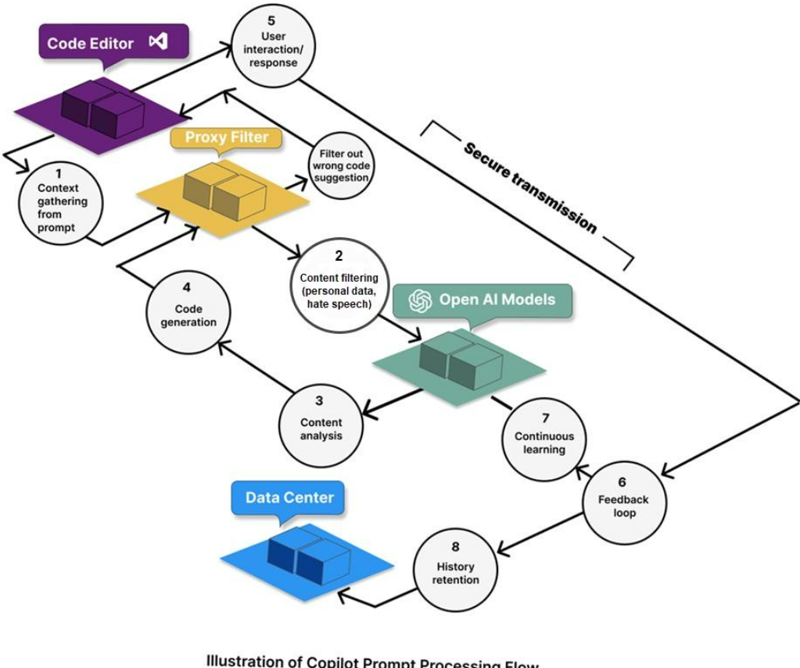

# GitHub Copilot Prompt Processing Architecture

## Introduction



The architecture diagram explains how a small code request from your editor travels to GitHub Copilot or an AI model, gets processed, and comes back as a code suggestion.

This document explains the flow using simple JavaScript examples.

Example: In VS Code, you type:

```javascript
// create a function to calculate discount price
```

Copilot may suggest:

```javascript
function calculateDiscountPrice(price, discountPercent) {
    return price - (price * discountPercent / 100);
}
```

Now let us understand how this happens stage by stage.

---

# Overall Architecture Flow

```text
Code Editor 
   ↓
Context Gathering
   ↓
Proxy Filter / Security Filter
   ↓
AI Model
   ↓
Content Analysis
   ↓
Code Generation
   ↓
Filter Wrong or Unsafe Suggestions
   ↓
User Receives Suggestion
   ↓
Feedback / History / Learning
```

GitHub Copilot uses your prompt plus extra context such as the current file, nearby code, and sometimes chat history to generate responses. It provides inline suggestions inside the editor and tries to match the context and style of your code.

---

# Stage 1: Context Gathering from Prompt

In the diagram, this is shown as:

```text
1. Context gathering from prompt
```

When you type a comment or partial code in VS Code, Copilot does not look only at that one line. It collects useful surrounding context.

Example file:

```javascript
const products = [
    { id: 1, name: "Laptop", price: 60000 },
    { id: 2, name: "Mouse", price: 800 },
    { id: 3, name: "Keyboard", price: 1500 }
];

// create a function to calculate discount price
```

Copilot may collect:

```text
Current comment:
create a function to calculate discount price

Nearby code:
products array contains price field

Programming language:
JavaScript

File style:
simple function-based code
```

So Copilot understands that you are probably expecting a **JavaScript function**, not Python or SQL.

---

# Stage 2: Content Filtering

In the diagram, this is:

```text
2. Content filtering
Personal data, hate speech
```

Before the prompt reaches the model, the system may check whether the content contains unsafe or sensitive information.

For example, if your file contains:

```javascript
const userPassword = "mypassword123";
const apiKey = "secret-key-value";
```

A security-aware system should avoid exposing or relying on secrets unnecessarily.

For a normal JavaScript request like this:

```javascript
// create a function to calculate discount price
```

There is no harmful content, so it continues to the next stage.

---

# Stage 3: Content Analysis

In the diagram:

```text
3. Content analysis
```

Here, the AI model analyzes what you want.

For this prompt:

```javascript
// create a function to calculate discount price
```

The model identifies:

```text
Task type: code generation
Language: JavaScript
Expected output: function
Function purpose: calculate discount price
Likely inputs: price, discount percentage
Likely output: final price after discount
```

It understands the intention from natural language and nearby code.

Important point:

```text
The AI does not understand like a human.
It predicts the most suitable code based on patterns, context, and training.
```

---

# Stage 4: Code Generation

In the diagram:

```text
4. Code generation
```

Now the model generates possible JavaScript code.

Possible suggestion:

```javascript
function calculateDiscountPrice(price, discountPercent) {
    return price - (price * discountPercent / 100);
}
```

It may also generate a safer version:

```javascript
function calculateDiscountPrice(price, discountPercent) {
    if (price < 0 || discountPercent < 0) {
        throw new Error("Price and discount percent must be positive values");
    }

    return price - (price * discountPercent / 100);
}
```

The output depends on your existing code style and the quality of your prompt.

---

# Stage 5: User Interaction / Response

In the diagram:

```text
5. User interaction / response
```

The generated suggestion is sent back to VS Code.

You may see it as grey inline text:

```javascript
function calculateDiscountPrice(price, discountPercent) {
    return price - (price * discountPercent / 100);
}
```

Then you can:

```text
Press Tab → Accept suggestion
Press Esc → Reject suggestion
Keep typing → Ask for another suggestion
Use Copilot Chat → Ask explanation or correction
```

This is the final visible response that you receive in the editor.

---

# Stage 6: Feedback Loop

In the diagram:

```text
6. Feedback loop
```

Copilot can learn from interaction signals such as whether you accepted, rejected, or edited a suggestion, depending on product settings and plan policies.

Example:

```text
You accept suggestion → It indicates suggestion was useful
You reject suggestion → It indicates suggestion may not be useful
You edit suggestion → It indicates partial usefulness
```

Important point:

```text
This does not mean your project is immediately retrained in front of you.
It means feedback can be used to improve the assistant experience and future model quality depending on GitHub Copilot data settings and plan type.
```

---

# Stage 7: Continuous Learning

In the diagram:

```text
7. Continuous learning
```

This represents improvement over time.

For example, Copilot may become better at:

```text
Understanding coding patterns
Generating secure code
Avoiding repeated mistakes
Providing better suggestions
Following common project structure
```

For enterprise or organization accounts, data usage and retention rules can be controlled differently from individual accounts. So this stage depends on GitHub plan, organization policy, and privacy settings.

---

# Stage 8: History Retention

In the diagram:

```text
8. History retention
```

This means some interaction history or context may be retained for product functionality, auditing, troubleshooting, or improving responses, depending on settings and account type.

Example:

```text
Current chat history
Previous prompt context
Accepted or rejected suggestion signals
Repository instructions
Editor context
```

For Copilot Chat, the chat history can help generate better follow-up answers because Copilot can use previous conversation context along with current file context.

---

# Proxy Filter in the Diagram

The **Proxy Filter** is an important security layer between the code editor and the AI model.

It can perform checks like:

```text
Remove unnecessary sensitive data
Filter unsafe prompt content
Validate request format
Prevent harmful or policy-violating output
Filter wrong or risky code suggestions
```

Example:

You type:

```javascript
// write code to store user password directly in database
```

A better suggestion should not store plain passwords. A safer suggestion may be:

```javascript
const bcrypt = require("bcrypt");

async function hashPassword(password) {
    const saltRounds = 10;
    return await bcrypt.hash(password, saltRounds);
}
```

So instead of giving insecure code, the system may guide toward secure coding practice.

---

# Secure Transmission

The diagram shows:

```text
Secure transmission
```

This means communication between your editor, Copilot services, and AI model should happen through secure network channels.

Simple meaning:

```text
Your editor sends prompt/context securely.
The AI service processes it.
The response comes back securely.
```

---

# Complete Example: JavaScript Flow

Suppose your file contains:

```javascript
const products = [
    { id: 1, name: "Laptop", price: 60000 },
    { id: 2, name: "Mouse", price: 800 },
    { id: 3, name: "Keyboard", price: 1500 }
];

// create a function to return products above given price
```

## What Copilot Receives as Context

Conceptually, it may understand:

```text
Language: JavaScript
Data: products array
Fields: id, name, price
Task: filter products by price
Expected function: accept price value and return matching products
```

## Possible Suggestion

```javascript
function getProductsAbovePrice(minPrice) {
    return products.filter(product => product.price > minPrice);
}
```

## Why This Suggestion Is Produced

Because the model sees:

```text
products is an array
each product has price
user asks return products above given price
JavaScript array filtering is commonly done using filter()
```

So it generates:

```javascript
products.filter(...)
```

---

# Another Example: If You Write Partial Code

You type:

```javascript
function calculateTotal(items) {
```

Copilot may check nearby code:

```javascript
const cartItems = [
    { product: "Laptop", price: 60000, quantity: 1 },
    { product: "Mouse", price: 800, quantity: 2 }
];
```

Then it may suggest:

```javascript
    return items.reduce((total, item) => {
        return total + item.price * item.quantity;
    }, 0);
}
```

It chooses this because:

```text
items is likely an array
each item has price and quantity
calculateTotal means sum all item totals
reduce() is commonly used for total calculation
```

---

# How Copilot Converts Your Text into Code

When you type:

```javascript
// create a function to validate email
```

It converts the intention like this:

```text
Natural language:
create a function to validate email

Internal understanding:
Need JavaScript function
Input should be email
Need return true or false
Use regular expression or string validation

Generated code:
function isValidEmail(email) { ... }
```

Possible output:

```javascript
function isValidEmail(email) {
    const emailPattern = /^[^\s@]+@[^\s@]+\.[^\s@]+$/;
    return emailPattern.test(email);
}
```

---

# Trainer Explanation

You can explain to students like this:

```text
GitHub Copilot works like an AI pair programmer.

It observes what we are typing in the editor, collects useful context from the current file, sends that context securely to an AI model, the model analyzes our intention, generates a possible code suggestion, filters unsafe or irrelevant output, and returns the suggestion inside VS Code.

The developer is still responsible for reviewing, testing, and correcting the generated code.
```

---

# Simple Architecture in One Line

```text
Your code/comment → Context collection → Security filtering → AI model analysis → Code generation → Output filtering → Suggestion in VS Code → User accepts/rejects
```

---

# Key Point

Copilot does not magically know your full requirement. It depends on the quality of your prompt and available context.

Better prompt:

```javascript
// create a function that accepts product array and returns products with price greater than 50000
```

Better output:

```javascript
function getExpensiveProducts(products) {
    return products.filter(product => product.price > 50000);
}
```

Poor prompt:

```javascript
// do it
```

Poor output:

```text
Copilot may not know what to generate.
```

So, for best results, write clear comments, meaningful variable names, and keep related code near the place where you want Copilot suggestion.

---

# Final Summary

GitHub Copilot prompt processing works in the following way:

```text
1. Developer writes code/comment in VS Code.
2. Copilot collects context from the current file and nearby code.
3. Security and proxy filters check the request.
4. AI model analyzes the intention.
5. AI model generates possible code.
6. Output filters remove unsafe or unsuitable suggestions.
7. Suggestion appears in VS Code.
8. Developer accepts, rejects, or edits the suggestion.
9. Feedback and history may help improve future interactions depending on settings.
```

The most important thing for developers is:

```text
Always review Copilot-generated code before using it.
Copilot helps generate code, but the developer is responsible for correctness, security, and testing.
```
